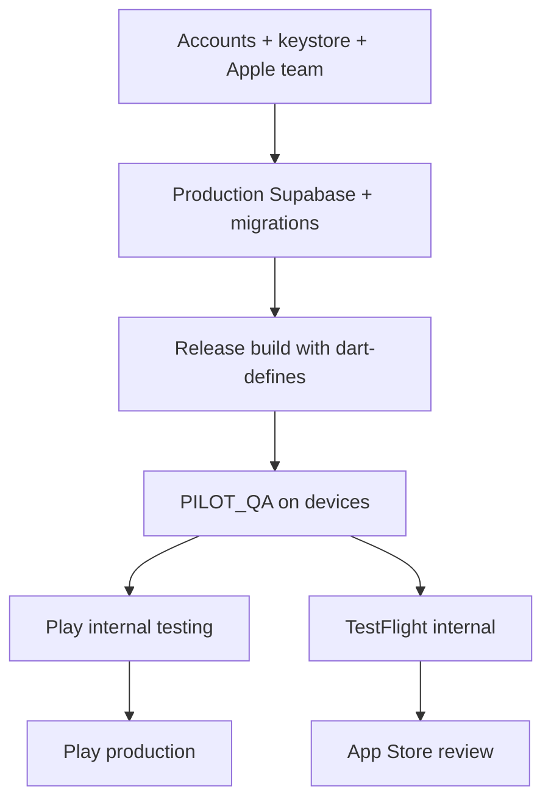

# Store deployment — Play Store & App Store

Checklist and build instructions for shipping **TailorFlow** (`ng.tailorflow.tailorflow_ng` / `ng.tailorflow.tailorflowNg`) to Google Play and Apple App Store.

Use this alongside:

| Doc | Purpose |
| --- | --- |
| [`STORE_LISTING.md`](STORE_LISTING.md) | Short/full description, pricing copy |
| [`PRIVACY_PILOT.md`](PRIVACY_PILOT.md) | NDPR notes, data categories |
| [`PILOT_QA.md`](../PILOT_QA.md) | Pre-release QA on real devices |
| [`PAYSTACK_SETUP.md`](PAYSTACK_SETUP.md) | Subscription backend (see billing policy below) |

---

## Current repo status

| Area | Status | Action |
| --- | --- | --- |
| App name & bundle IDs | Done | Display: **TailorFlow**; Android `ng.tailorflow.tailorflow_ng`; iOS `ng.tailorflow.tailorflowNg` |
| Version | `1.0.0+1` in `pubspec.yaml` | Bump `version:` before each store upload (`1.0.1+2` = name `1.0.1`, build `2`) |
| Privacy policy URL | Done | `https://tailorflow.kennyonifade.com/privacy.html` |
| Store listing copy | Done | [`STORE_LISTING.md`](STORE_LISTING.md) |
| iOS app icons | Done | `ios/Runner/Assets.xcassets/AppIcon.appiconset/` |
| Android launcher icon | Placeholder | Replace green triangle vector with production mipmap icons (see [Icons](#icons)) |
| Android release signing | Template added | Generate keystore + `android/key.properties` (see [Android signing](#android-signing)) |
| iOS camera/photo permissions | Done | `Info.plist` usage strings for `image_picker` |
| iOS Privacy Manifest | Done | `ios/Runner/PrivacyInfo.xcprivacy` |
| Release build uses debug key | Fixed in Gradle | Requires your `key.properties` before Play upload |
| CI/CD | Not configured | Add GitHub Actions / Codemagic when accounts exist |
| In-app subscriptions | Paystack (web checkout) | **Policy risk** on both stores — see [Billing & store policy](#billing--store-policy) |

---

## Accounts you need

### Google Play

1. [Google Play Console](https://play.google.com/console) — one-time **$25** registration.
2. Create app → **TailorFlow**, default language English, app/game = App, free (subscriptions described in listing).
3. Complete **Developer account verification** (identity, possibly organization).

### Apple App Store

1. [Apple Developer Program](https://developer.apple.com/programs/) — **$99/year**.
2. Enroll as individual or organization (organization needs D-U-N-S number).
3. [App Store Connect](https://appstoreconnect.apple.com/) → **My Apps** → **+** → New App.

---

## Shared prerequisites (both platforms)

### 1. Production backend

Release builds must include compile-time defines (not `.env` files):

```bash
flutter build appbundle --release \
  --dart-define=SUPABASE_URL=https://YOUR_PROJECT.supabase.co \
  --dart-define=SUPABASE_ANON_KEY=YOUR_ANON_KEY \
  --dart-define=SENTRY_DSN=https://YOUR_DSN@o....ingest.sentry.io/.... \
  --dart-define=REMOTE_PAYWALL=true
```

| Define | Required for production? | Notes |
| --- | --- | --- |
| `SUPABASE_URL` | Yes (if sync/subscriptions) | Empty = no cloud sync |
| `SUPABASE_ANON_KEY` | Yes (if sync/subscriptions) | Public anon key only |
| `SENTRY_DSN` | Recommended | Omit for first pilot if sensitive |
| `REMOTE_PAYWALL` | When billing live | Default `false`; set `true` when Paystack is production-ready |

Apply Supabase migrations (`001`–`004`) before shipping. See [`PAYSTACK_SETUP.md`](PAYSTACK_SETUP.md).

### 2. QA gate

Run [`PILOT_QA.md`](../PILOT_QA.md) on **physical** Android and iPhone hardware before submitting.

### 3. Store assets

| Asset | Play Store | App Store |
| --- | --- | --- |
| App icon | 512×512 PNG (32-bit, no alpha) | 1024×1024 PNG (no transparency, no rounded corners) |
| Phone screenshots | Min 2; 16:9 or 9:16; JPEG/PNG | 6.7" + 6.5" or 5.5" sizes (see App Store Connect) |
| Feature graphic | 1024×500 PNG/JPEG | N/A |
| Short description | 80 chars max | Subtitle (30 chars) |
| Full description | 4000 chars max | Description (4000 chars) |
| Privacy policy URL | Required | Required |
| Support email / URL | Required | Required |

Copy is in [`STORE_LISTING.md`](STORE_LISTING.md). Capture screenshots from: customers list, order detail, WhatsApp handoff, settings/branding.

### 4. Icons

Android currently uses a placeholder vector (`android/app/src/main/res/drawable/ic_launcher.xml`). Before Play submission:

```bash
# Option A: flutter_launcher_icons (add to pubspec dev_dependencies)
flutter pub run flutter_launcher_icons

# Option B: export PNGs into mipmap-* folders manually from your 1024 master
```

iOS icons are already present under `ios/Runner/Assets.xcassets/AppIcon.appiconset/`.

---

## Android (Google Play)

### Android signing

**One-time — create upload keystore** (store file and passwords securely; loss = cannot update the app):

```bash
keytool -genkey -v \
  -keystore ~/tailorflow-upload-keystore.jks \
  -keyalg RSA -keysize 2048 -validity 10000 \
  -alias upload
```

Copy the example and fill in values (never commit the real file):

```bash
cp android/key.properties.example android/key.properties
# Edit: storePassword, keyPassword, keyAlias, storeFile
```

`android/app/build.gradle.kts` reads `key.properties` for release signing when the file exists.

**Play App Signing:** Enroll when creating the app. Google holds the app signing key; you upload with the upload key above.

### Build App Bundle (required for new apps)

```bash
flutter build appbundle --release \
  --dart-define=SUPABASE_URL=... \
  --dart-define=SUPABASE_ANON_KEY=... \
  --dart-define=REMOTE_PAYWALL=true
```

Output: `build/app/outputs/bundle/release/app-release.aab`

Upload in Play Console → **Production** (or **Internal testing** first) → **Create new release**.

### Play Console checklist

- [ ] **App content** → Privacy policy URL
- [ ] **App content** → Ads declaration (No ads)
- [ ] **App content** → Content rating questionnaire (IARC)
- [ ] **App content** → Target audience & families policy
- [ ] **App content** → Data safety form — declare:
  - Personal info: name, phone (customer records entered by shop)
  - Financial info: payment amounts (local order records)
  - Photos: optional fabric/logo images via camera/gallery
  - Data encrypted in transit (Supabase TLS)
  - Users can request deletion (document contact in privacy policy)
- [ ] **Store listing** — text from [`STORE_LISTING.md`](STORE_LISTING.md)
- [ ] **Pricing** — Free app; describe subscriptions in description (not Play Billing products unless you migrate)
- [ ] **Countries** — Nigeria + any expansion markets
- [ ] Internal testing track → promote to closed/open/production

### Internal testing first (recommended)

1. Play Console → **Testing → Internal testing** → create release with `.aab`.
2. Add tester emails; share opt-in link.
3. Fix issues, bump `version` in `pubspec.yaml`, ship new bundle.

---

## iOS (App Store)

Requires a **Mac with Xcode** for archive/upload (or CI macOS runner).

### Xcode project setup

1. Open `ios/Runner.xcworkspace` in Xcode.
2. **Runner** target → **Signing & Capabilities**:
   - Team: your Apple Developer team
   - Bundle Identifier: `ng.tailorflow.tailorflowNg` (must match App Store Connect)
   - Automatically manage signing: ON (for first ship)
3. Set **Deployment Target** to match Flutter minimum (check `ios/Podfile` / Flutter docs).

### App Store Connect

1. **My Apps → + → New App**
   - Platform: iOS
   - Name: TailorFlow
   - Primary language: English
   - Bundle ID: `ng.tailorflow.tailorflowNg`
   - SKU: e.g. `tailorflow-ng-001`
2. **App Privacy** (nutrition labels) — align with [`PRIVACY_PILOT.md`](PRIVACY_PILOT.md):
   - Contact info, user content (measurements/orders), financial info
   - Linked to user: yes (shop account when signed in)
   - Used for app functionality; not sold
3. **Pricing**: Free
4. **App Review Information**: demo account if login required; notes explaining offline-first + optional Supabase sign-in

### Build & upload

```bash
flutter build ipa --release \
  --dart-define=SUPABASE_URL=... \
  --dart-define=SUPABASE_ANON_KEY=... \
  --dart-define=REMOTE_PAYWALL=true
```

Or in Xcode: **Product → Archive** → **Distribute App** → App Store Connect.

Output (CLI): `build/ios/ipa/*.ipa` — upload via **Transporter** app or `xcrun altool`.

### TestFlight (recommended)

1. Upload build → processing (~15–30 min).
2. **TestFlight** → internal testers (team) then external (up to 10,000).
3. Submit for **App Review** when TestFlight is stable.

### iOS-specific notes

- **Usage descriptions** for camera and photo library are in `ios/Runner/Info.plist` (required for fabric photos and shop logo).
- **Privacy Manifest** at `ios/Runner/PrivacyInfo.xcprivacy` documents required-reason API usage.
- **Export compliance**: typically “No” for standard HTTPS-only encryption; confirm in App Store Connect questionnaire.

---

## Billing & store policy

TailorFlow subscriptions use **Paystack** via a **WebView checkout**, not Google Play Billing or StoreKit.

| Store | Risk | Mitigation options |
| --- | --- | --- |
| **Google Play** | Digital features sold outside Play Billing may violate [Payments policy](https://support.google.com/googleplay/android-developer/answer/9858738) | (1) Ship v1 **without** paywall (`REMOTE_PAYWALL=false`) and enable billing later via Play Billing; (2) Limit Paystack to **physical/service** context if applicable; (3) Request policy guidance / use alternative distribution (APK sideload) outside Play |
| **Apple App Store** | In-app digital unlocks generally require [IAP](https://developer.apple.com/app-store/review/guidelines/#business) | (1) v1 without in-app subscription UI; (2) Implement StoreKit for iOS subscriptions; (3) Reader/external-purchase exceptions unlikely to apply here |

**Practical recommendation for first store submission:**

1. Submit with `REMOTE_PAYWALL=false` (free tier only) to reduce review friction.
2. Enable Paystack paywall on **direct APK** distribution first ([`docs/BRANDING.md`](BRANDING.md)).
3. Plan StoreKit + Play Billing integration before turning on paid tiers in store builds.

Document your chosen approach in App Review notes if you ship with Paystack enabled.

---

## Version bumps

Edit `pubspec.yaml`:

```yaml
version: 1.0.1+2   # 1.0.1 = user-facing, 2 = build number (must increase every upload)
```

Both stores reject uploads with duplicate build numbers.

---

## Optional: CI/CD sketch

When ready, automate on tag push `v*`:

1. Install Flutter 3.24+
2. Decode signing secrets (Android keystore base64, iOS certificates via Fastlane Match or App Store Connect API key)
3. Run `flutter test`
4. `flutter build appbundle` / `flutter build ipa` with `--dart-define` from CI secrets
5. Upload to Play Internal Testing + TestFlight

No workflow exists in this repo yet — add `.github/workflows/release.yml` or use [Codemagic](https://codemagic.io/) Flutter templates.

---

## Submission order (suggested)



1. Google Play internal testing (faster iteration, no Mac required for upload).
2. TestFlight in parallel once Mac/Xcode access is available.
3. Production after QA sign-off on both.

---

## Quick command reference

```bash
# Android App Bundle (Play Store)
flutter build appbundle --release \
  --dart-define=SUPABASE_URL=$SUPABASE_URL \
  --dart-define=SUPABASE_ANON_KEY=$SUPABASE_ANON_KEY

# Android APK (direct install / GitHub Releases — not for Play)
flutter build apk --release \
  --dart-define=SUPABASE_URL=$SUPABASE_URL \
  --dart-define=SUPABASE_ANON_KEY=$SUPABASE_ANON_KEY

# iOS (Mac required)
flutter build ipa --release \
  --dart-define=SUPABASE_URL=$SUPABASE_URL \
  --dart-define=SUPABASE_ANON_KEY=$SUPABASE_ANON_KEY
```

---

## Open items before “go live”

- [ ] Replace Android placeholder launcher icon with production artwork
- [ ] Create `android/key.properties` + upload keystore (secure backup)
- [ ] Register Play Console + Apple Developer accounts
- [ ] Complete Play Data safety + Apple App Privacy questionnaires
- [ ] Capture store screenshots on real devices
- [ ] Decide paywall strategy for store builds (see [Billing & store policy](#billing--store-policy))
- [ ] Run full [`PILOT_QA.md`](../PILOT_QA.md) matrix
- [ ] Set up CI/CD for repeatable signed builds
